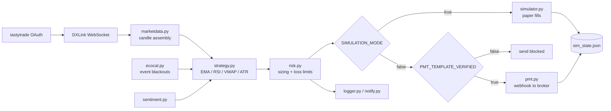

# Algorithmic Futures Trading System

An event-driven trading system in Python that ingests real-time CME futures data over a
WebSocket feed, evaluates a multi-indicator strategy on a rolling window, applies layered
risk controls, and routes orders to a brokerage execution layer via webhook.

Built solo, from scratch. Runs on live market data.

> **Disclaimer.** This is an engineering portfolio project, not financial advice and not a
> product. Trading leveraged futures carries substantial risk of loss. Nothing here is a
> recommendation to trade, and no performance claims are made.

---

## Why this exists

I wanted a project that forced me to solve the problems real systems have rather than the
problems tutorials have: authenticating against a vendor whose SDK doesn't work, parsing a
streaming protocol with an undocumented handshake, surviving a mid-session crash without
losing state, and deciding what the system should refuse to do.

The trading strategy is almost the least interesting part. The engineering around it —
staged rollout, failure recovery, guardrails — is the point.

---

## Architecture



### Modules

| File | Responsibility |
|---|---|
| `bot.py` | Main event loop; wires every component together |
| `config.py` | Central configuration, mode flags, and risk parameters |
| `marketdata.py` | Feed abstraction, candle assembly, provider fallback chain |
| `tt_marketdata.py` | tastytrade/DXLink live feed: auth, handshake, subscription |
| `strategy.py` | Signal generation across multiple indicators and timeframes |
| `risk.py` | Position sizing, stop placement, daily loss and drawdown limits |
| `simulator.py` | Paper execution engine with realistic cost modeling |
| `pmt.py` | Live order routing via webhook payload construction |
| `ecocal.py` | Economic-calendar blackout windows |
| `sentiment.py` | LLM-assisted supplementary signal input |
| `logger.py` | Structured logging |
| `notify.py` | Email alerting on fills, errors, and limit breaches |
| `reset_for_live.py` | Session state archiving and reset helper |

---

## Execution gating

Two independent flags stand between a signal and a real order. Both live in `config.py`.

| Flag | Default | Effect |
|---|---|---|
| `SIMULATION_MODE` | `True` | Routes fills to `simulator.py`. No broker contact. |
| `USE_REAL_DATA` | `True` | Pulls the live tastytrade feed even while simulating. |
| `PMT_TEMPLATE_VERIFIED` | gate | Blocks webhook sends until the payload schema is confirmed. |

The combination that matters is `SIMULATION_MODE = True` with `USE_REAL_DATA = True` —
**observe mode**. Real market data, real signal generation, real risk evaluation, simulated
fills. It's how the system was validated against live conditions with no capital exposed.

Turning off `SIMULATION_MODE` alone is not enough to place an order; the webhook gate has to
be satisfied separately.

---

## Engineering problems worth reading about

**A vendor SDK that couldn't authenticate.**
The official tastytrade client failed partway through the OAuth flow. Rather than abandon the
data source, I traced the request sequence and reimplemented the token exchange with direct
`httpx` calls, caching the token with TTL-based refresh so the system doesn't
re-authenticate on every reconnect. The SDK is no longer a dependency.

**An undocumented streaming handshake.**
The DXLink WebSocket requires a strict ordered sequence — setup, authorization, channel
request, channel open, feed configuration, subscription — and drops the connection silently
on any deviation. Getting it right meant reading protocol traffic rather than documentation.

**Bad data that looked like good signals.**
Two bugs produced plausible-but-wrong output. A volume filter was being inflated by single
spike bars, fixed by switching from a mean to a rolling median. Resampled proxy data emitted
zero-volume bars, fixed with forward-fill. Both were invisible until simulated fills were
compared against what the market actually did — in data pipelines, silence is not the same as
correctness.

**Provider fallback.**
Market data degrades through a chain: Databento for real futures data, then Finnhub, then
Alpha Vantage as proxy sources. Each fallback is lower fidelity, so the system logs which
tier it's running on rather than pretending the data is equivalent.

**Crash recovery.**
An early version lost position state on a mid-session restart. State now persists after every
trade, so the system resumes from disk rather than from a blank slate.

---

## Running it

```bash
git clone https://github.com/geneailbstr/futures-trading-system.git
cd futures-trading-system

python3 -m venv venv
source venv/bin/activate
pip install -r requirements.txt

cp .env.example .env
# fill in .env with your own credentials

python bot.py
```

Credentials come from `.env`. Mode flags and risk parameters live in `config.py`, which ships
with `SIMULATION_MODE = True` — the system will not contact a broker until that is changed
deliberately.

---

## Tests

```bash
pip install -r requirements.txt
pytest tests/ -v
```

21 unit tests cover position sizing and the daily circuit breakers in `risk.py`.

The suite checks behavior rather than constants — thresholds are read from `config.py`, so
retuning risk parameters doesn't invalidate the tests. What they assert:

- A tighter stop must permit more contracts, and MES must size smaller than MNQ at the same
  stop distance, since contract point value is the denominator
- Position size never rounds down to zero, however wide the stop
- Ranging-market and news damping can only reduce size, never increase it
- Every circuit breaker actually blocks: max trades, daily loss, profit lock, consecutive
  losses
- The 80% warning fires *strictly before* the hard stop — a warning that triggers at the same
  moment as the block serves no purpose

`RiskManager` loads persistent state from disk on construction, so the test fixture points
`STATE_FILE` at a temp directory via `monkeypatch`. The tests never read or write real
trading state, and results don't drift depending on the day they're run.

---

## Tooling

`scrub_check.sh` is a pre-commit secret scanner written for this repo. It scans tracked files
and the full commit history for hardcoded credentials, verifies `.env` isn't tracked, and
flags state or log files that shouldn't be committed.

```bash
./scrub_check.sh
```

It exits non-zero on a finding, so it can be wired into a pre-commit hook or CI step.

---

## Status

Running in observe mode against live data. The execution path is implemented and tested
against the broker's payload schema, but remains gated.

## Stack

Python · WebSockets · OAuth 2.0 · REST APIs · pandas · asyncio · pytest

---

## License

MIT — see [LICENSE](LICENSE).
