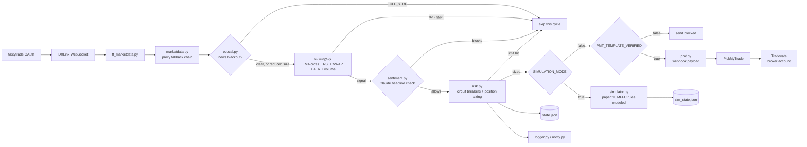

# Algorithmic Futures Trading System

A Python trading bot for MNQ and MES micro futures. It authenticates against
tastytrade's OAuth/DXLink feed for real-time CME data, evaluates an
EMA/RSI/VWAP/ATR strategy across two timeframes on every polling cycle,
sizes and gates each candidate trade through a risk manager built around
MyFundedFutures (MFFU) Flex evaluation rules, and — once explicitly
unlocked — routes the order to Tradovate through a PickMyTrade webhook.
Everything runs from the command line as a scheduled loop; there's no
framework, no database, and no UI. State persists to local JSON files
between runs.

Built solo, from scratch. Runs on live market data.

> **Disclaimer.** This is an engineering portfolio project, not financial advice and not a
> product. Trading leveraged futures carries substantial risk of loss. Nothing here is a
> recommendation to trade, and no performance claims are made.

---

## Why this exists

I wanted a project that forced me to solve the problems real systems have rather than the
problems tutorials have: authenticating against a vendor whose SDK doesn't work, parsing a
streaming protocol with an undocumented handshake, surviving a mid-session crash without
losing state, and deciding what the system should refuse to do.

The trading strategy is almost the least interesting part. The engineering around it —
staged rollout, failure recovery, guardrails — is the point.

---

## Architecture



`ecocal.py`'s blackout check and `sentiment.py`'s headline check are both gates *around*
`strategy.py`, not inputs into its indicator math — a full-stop news window skips the scan
entirely before `strategy.py` ever runs, and sentiment only evaluates a signal `strategy.py`
already produced, after the fact. `risk.py` enforces circuit breakers before `bot.py` even
scans for signals, and again immediately before sizing a specific trade.

The broker connection itself is PickMyTrade's webhook integration, external to this
codebase — `pmt.py` only has to speak PickMyTrade's payload schema, not Tradovate's API
directly.

### Modules

| File | Responsibility |
|---|---|
| `bot.py` | Main event loop; schedules pre-market setup, the 60s trading loop, EOD close, and the 16:05 report; wires every component together |
| `config.py` | Central configuration — mode flags, risk parameters, indicator settings, all `.env`-backed credentials |
| `marketdata.py` | Feed abstraction: tries the real tastytrade feed first (via `tt_marketdata.py`), falls back through yfinance → Finnhub → Alpha Vantage → Databento proxy data |
| `tt_marketdata.py` | tastytrade OAuth (direct `httpx`, not the SDK) + DXLink live feed: handshake, subscription, candle parsing |
| `strategy.py` | Signal generation — EMA(9/21) crossover confirmed by RSI, VWAP position, and a rolling-median volume filter, across 5-min and 15-min timeframes |
| `risk.py` | Position sizing (adaptive to win/loss streaks), daily circuit breakers, and the MFFU consistency look-back check |
| `simulator.py` | Paper-fill engine used while `SIMULATION_MODE = True` — models slippage, commissions, and the full MFFU Flex/Rapid rule set (eval, funded, payout) |
| `pmt.py` | Builds and sends the PickMyTrade webhook payload; the actual order-routing path when `SIMULATION_MODE = False` |
| `ecocal.py` | Economic-calendar blackout windows (ForexFactory feed) — full-stop on Tier 1 events, reduced size on Tier 2 |
| `sentiment.py` | Optional Claude-based headline sentiment check, gated by `USE_SENTIMENT` (off by default) |
| `logger.py` | CSV trade log + console status printing |
| `notify.py` | Gmail email alerts — daily reports, volatility skips, payout alerts |
| `reset_for_live.py` | One-time Monday-morning helper: archives simulation state so the live eval account starts clean |

---

## Execution gating

Two independent flags stand between a signal and a real order. Both live in `config.py`.

| Flag | Default | Effect |
|---|---|---|
| `SIMULATION_MODE` | `True` | Routes fills to `simulator.py`. No broker contact. |
| `USE_REAL_DATA` | `True` | Pulls the live tastytrade feed even while simulating. |
| `PMT_TEMPLATE_VERIFIED` | `True` | Gate on `pmt.py` sends — code-level only, doesn't override `SIMULATION_MODE`. |

The combination that matters is `SIMULATION_MODE = True` with `USE_REAL_DATA = True` —
**observe mode**. Real market data, real signal generation, real risk evaluation, simulated
fills. It's how the system was validated against live conditions with no capital exposed.

Turning off `SIMULATION_MODE` alone is not enough to place an order; the webhook gate has to
be satisfied separately, and `pmt.py` additionally refuses to send if `PICKMYTRADE_WEBHOOK`
or `PICKMYTRADE_TOKEN` aren't set.

---

## MFFU rule constraints `risk.py` enforces

`risk.py`'s `RiskManager` is the live-mode risk gate (the `SIMULATION_MODE = True` path uses
a separate, more detailed rule model in `simulator.py` — see its `FLEX_RULES`/`RAPID_RULES`
for eval/funded/payout specifics). What `risk.py` itself enforces:

- **Adaptive position sizing** — `calculate_position_size()` starts from `BASE_RISK` (1% of
  balance), scales down to `MIN_RISK` after `ADAPTIVE_LOSS_THRESHOLD` consecutive losses and
  up to `MAX_RISK` after `ADAPTIVE_WIN_THRESHOLD` consecutive wins, then applies a ranging-market
  halving, Monday/OPEX-Friday size reductions, and a news-factor multiplier from `ecocal.py` —
  in that order, all multiplicative, so no modifier can push size back up past what an earlier
  one already reduced it to.
- **Daily circuit breakers** (`check_daily_limits()`) — trading stops for the day if any of:
  `MAX_TRADES_PER_DAY` is reached, `daily_pnl` breaches `-DAILY_LOSS_LIMIT` (2% of starting
  balance), `daily_pnl` reaches `PROFIT_LOCK_PCT` (2.5%, i.e. $625 on a $25K account), or
  `CONSECUTIVE_LOSS_STOP` (4) losses land in a row. `approaching_daily_limit()` fires a warning
  at 80% of the daily loss limit — strictly before the hard stop, not at the same threshold.
- **Why `PROFIT_LOCK_PCT` is 2.5%, specifically** — MFFU's consistency rule caps any single
  day at 50% of total profit. The eval profit target is $1,500, so 50% of that is a $750
  ceiling. Locking profit at $625/day leaves headroom under $750 even if the day's last trade
  runs hot past the lock point before the position actually closes. Changing this constant
  changes eval compliance, not just bot behavior.
- **The consistency ratio is deliberately *not* a live trade blocker.** `check_consistency_ratio()`
  computes best-single-day-profit / total-profit as a look-back, gated on the `eval_passed`
  flag, and `_apply_consistency_cap()` is a passthrough that returns `risk_amount` unchanged.
  An earlier version recalculated a live ceiling off same-day `total_profit` and hard-blocked
  new trades the instant `daily_pnl` crossed it — on day 1, `total_profit` starts at $0, so
  that ceiling was effectively $0, throttling the very first trading day to nothing for no
  rule-based reason. MFFU only checks the ratio when you request a pass; a breach mid-eval
  doesn't fail the account, it just means the pass target moves (`2x` the best day) until
  later profit brings the ratio back under 50%. `risk.py` tracks the ratio for visibility, it
  doesn't gate on it.
- **Qualifying days and payout tracking** (`end_of_day()`) — a day counts toward
  `MIN_QUALIFYING_PROFIT` ($100+) once, persisted in `qualifying_dates` so a day can't
  double-count on a same-day restart. Payout eligibility requires `MIN_PAYOUT_DAYS` (5)
  qualifying days and `MIN_PAYOUT_AMOUNT` ($250) available at `MAX_PAYOUT_PCT` (50% of total
  profit) — matching MFFU's confirmed 80/20 profit split.
- **State persists to `state.json`** after every `end_of_day()` call — consecutive win/loss
  streaks, qualifying days, and total profit all survive a restart instead of resetting.

---

## Setup

```bash
git clone https://github.com/geneailbstr/futures-trading-system.git
cd futures-trading-system

python3 -m venv venv
source venv/bin/activate
pip install -r requirements.txt

cp .env.example .env
# fill in .env with your own credentials — see the table below for what's actually required

python bot.py
```

`config.py` ships with `SIMULATION_MODE = True` — the system will not contact a broker until
that's changed deliberately, and `pmt.py` never touches a real account with the defaults as
checked in.

### Environment variables

All credentials load from `.env` (never committed — see `.gitignore`) via `config.py`.
`bot.py`'s startup check is stricter than it might look: **Gmail credentials are required even
in pure simulation mode** — `main()` refuses to start without them, since email is how the
daily report gets delivered regardless of mode.

| Variable | Required when | Used by |
|---|---|---|
| `TRADOVATE_ACCOUNT_ID` | Live mode (`pmt.py` default account id) | `pmt.py` |
| `TASTYTRADE_CLIENT_SECRET` / `TASTYTRADE_REFRESH_TOKEN` | Whenever real market data is pulled (`USE_REAL_DATA = True`, the default) | `tt_marketdata.py` |
| `PICKMYTRADE_TOKEN` / `PICKMYTRADE_WEBHOOK` | Live mode only (`SIMULATION_MODE = False`) | `pmt.py` |
| `DATABENTO_API_KEY` | Optional — enables the Databento proxy/live fallback tier | `marketdata.py` |
| `FINNHUB_API_KEY` | Optional — enables the Finnhub proxy fallback tier | `marketdata.py` |
| `ALPHA_VANTAGE_API_KEY` | Optional — final proxy fallback tier | `marketdata.py` |
| `ANTHROPIC_API_KEY` | Only if `USE_SENTIMENT = True` (default `False`) | `sentiment.py` |
| `GMAIL_ADDRESS` / `GMAIL_APP_PASSWORD` | **Always** — `bot.py` refuses to start without these | `notify.py` |
| `NOTIFY_EMAIL` | Always (destination for alerts/reports) | `notify.py` |

---

## Testing

```bash
pip install -r requirements.txt
pytest tests/ -v
```

43 unit tests: 21 in `tests/test_risk.py`, 22 in `tests/test_strategy.py`. Neither suite makes
a live network call at test time.

**`tests/test_risk.py`** covers `RiskManager`'s position sizing and daily circuit breakers.
Thresholds are read from `config.py` rather than hardcoded, so retuning risk parameters
doesn't invalidate the tests. `RiskManager` loads persistent state from disk on construction,
so the fixture points `STATE_FILE` at a temp directory via `monkeypatch` — tests never read or
write real trading state.

**`tests/test_strategy.py`** covers the volume filter, ATR-based stops, EMA crossover entry,
and RSI/VWAP confirmation in `strategy.py`, against **real recorded MNQ bars**:
`tests/fixtures/mnq_5min_recorded.csv` and `mnq_15min_recorded.csv` were pulled once via
`tt_marketdata.get_bars_tastytrade()` and frozen to disk — not synthetic data, and not a live
call made during test runs. Every scenario a test depends on (a real EMA crossover, a real
volume spike, a quiet no-trigger stretch) was located by running
`calculate_indicators()`/`generate_signal()` over the recorded window and scanning for a
genuine occurrence, rather than hand-tuning price data to force one. Each `generate_signal()`
call in the suite truncates both timeframes to the timestamp being evaluated, so no test sees
bars from after the moment it's asking about — the same causal constraint the live bot
operates under. A dedicated test also guards against `strategy.py`'s volume-gate multiplier
and `config.VOLUME_MULTIPLIER` silently drifting apart.

---

## Engineering problems worth reading about

**A vendor SDK that couldn't authenticate.**
The official tastytrade client failed partway through the OAuth flow. Rather than abandon the
data source, I traced the request sequence and reimplemented the token exchange with direct
`httpx` calls, caching the token with TTL-based refresh so the system doesn't
re-authenticate on every reconnect. The SDK is no longer a dependency.

**An undocumented streaming handshake.**
The DXLink WebSocket requires a strict ordered sequence — setup, authorization, channel
request, channel open, feed configuration, subscription — and drops the connection silently
on any deviation. Getting it right meant reading protocol traffic rather than documentation.

**Bad data that looked like good signals.**
Two bugs produced plausible-but-wrong output. A volume filter was being inflated by single
spike bars, fixed by switching from a mean to a rolling median. Resampled proxy data emitted
zero-volume bars, fixed with forward-fill. Both were invisible until simulated fills were
compared against what the market actually did — in data pipelines, silence is not the same as
correctness.

**A risk rule that was stricter than the actual eval.** The MFFU consistency check is a
look-back ratio evaluated only when you request a pass — not a rule that should block a trade
mid-day. An earlier version computed a live ceiling off same-day cumulative profit, which was
$0 on day 1 and throttled the very first trading day for no reason tied to the actual rule.
Fixing it meant separating "track this for visibility" from "block on this."

**Provider fallback.**
Market data degrades through a chain: the real tastytrade/DXLink feed first, then yfinance,
Finnhub, and Alpha Vantage proxy sources if it's unavailable. Each fallback is lower fidelity,
so the system logs which tier it's running on rather than pretending the data is equivalent.

**Crash recovery.**
An early version lost position state on a mid-session restart. State now persists after every
trade, so the system resumes from disk rather than from a blank slate.

---

## Tooling

`scrub_check.sh` is a pre-commit secret scanner written for this repo. It scans tracked files
and the full commit history for hardcoded credentials, verifies `.env` isn't tracked, and
flags state or log files that shouldn't be committed.

```bash
./scrub_check.sh
```

It exits non-zero on a finding, so it can be wired into a pre-commit hook or CI step.

---

## Status

Running in observe mode against live data. The execution path (`pmt.py` → PickMyTrade →
Tradovate) is implemented and tested against the broker's payload schema, but remains gated
behind `SIMULATION_MODE` and `PMT_TEMPLATE_VERIFIED`.

## Stack

Python · WebSockets · OAuth 2.0 · REST APIs · pandas · asyncio · pytest

---

## License

MIT — see [LICENSE](LICENSE).
