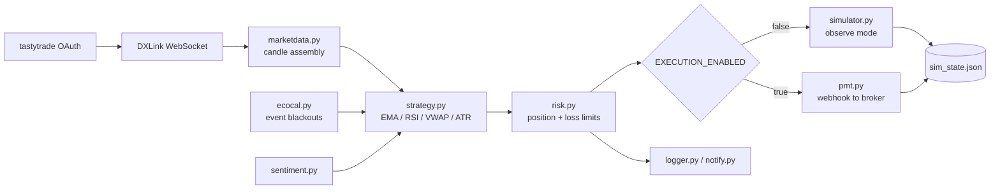

# Algorithmic Futures Trading System

An event-driven trading system in Python that ingests real-time CME futures data over a
WebSocket feed, evaluates a multi-indicator strategy on a rolling window, applies layered
risk controls, and routes orders to a brokerage execution layer via webhook.

Built solo, from scratch. Runs on live market data.

> **Disclaimer.** This is an engineering portfolio project, not financial advice and not a
> product. Trading leveraged futures carries substantial risk of loss. Nothing here is a
> recommendation to trade, and no performance claims are made.

---

## Why this exists

I wanted a project that forced me to solve the problems real systems have rather than the
problems tutorials have: authenticating against a vendor whose SDK doesn't work, parsing a
streaming protocol with an undocumented handshake, surviving a mid-session crash without
losing state, and deciding what the system should refuse to do.

The trading strategy is almost the least interesting part. The engineering around it —
staged rollout, failure recovery, guardrails — is the point.

---

## Architecture



### Modules

| File | Responsibility |
|---|---|
| `bot.py` | Main event loop; wires every component together |
| `config.py` | Central configuration and runtime toggles |
| `marketdata.py` | Feed abstraction, candle assembly, resampling |
| `tt_marketdata.py` | tastytrade/DXLink live feed: auth, handshake, subscription |
| `strategy.py` | Signal generation across multiple indicators and timeframes |
| `risk.py` | Position sizing, stop placement, daily loss and profit-lock limits |
| `simulator.py` | Paper execution engine used for observe mode |
| `pmt.py` | Live order routing via webhook payload construction |
| `ecocal.py` | Economic-calendar blackout windows |
| `sentiment.py` | Supplementary signal input |
| `logger.py` | Structured logging |
| `notify.py` | Alerting on fills, errors, and limit breaches |
| `reset_for_live.py` | Session state archiving and reset helper |

---

## Engineering problems worth reading about

**A vendor SDK that couldn't authenticate.**
The official client failed partway through the OAuth flow. Rather than abandon the data
source, I traced the request sequence and reimplemented the token exchange with direct HTTP
calls, adding a token cache with TTL-based refresh so the system doesn't re-authenticate on
every reconnect.

**An undocumented streaming handshake.**
The market data WebSocket requires a strict ordered sequence — setup, authorization,
channel request, channel open, feed configuration, subscription — with the connection
silently dropping on any deviation. Getting this right meant reading protocol traffic rather
than documentation.

**Bad data that looked like good signals.**
Two separate bugs produced plausible-but-wrong output. A volume filter was being inflated by
single spike bars, which I fixed by switching from a mean to a rolling median. Resampled
proxy data was emitting zero-volume bars, fixed with forward-fill. Both were invisible until
I compared simulated fills against what the market actually did — a reminder that in data
pipelines, silence is not the same as correctness.

**Crash recovery.**
An early version lost its position state on a mid-session restart. State is now persisted
after every trade, so the system resumes from disk rather than from a blank slate.

**Refusing to run before it was ready.**
The system has an `EXECUTION_ENABLED` flag. It ran for an extended period in observe mode —
real feed, real signals, order dispatch blocked — so signal quality could be validated
against live conditions with no capital at risk. Shipping fast is easy; the harder call is
building the thing that stops you from shipping too early.

---

## Running it

```bash
git clone https://github.com/<your-handle>/<repo-name>.git
cd <repo-name>

python3 -m venv venv
source venv/bin/activate
pip install -r requirements.txt

cp .env.example .env
# fill in .env with your own credentials

python bot.py
```

Defaults are deliberately safe: `USE_REAL_DATA=false` and `EXECUTION_ENABLED=false`.
The system will not place an order until both are explicitly turned on.

---

## Status

Currently running in observe mode against live data. Execution path is implemented and
tested against the broker's schema but remains gated behind the execution flag.

## Stack

Python · WebSockets · OAuth 2.0 · REST APIs · pandas · asyncio

---

## License

MIT — see [LICENSE](LICENSE).
